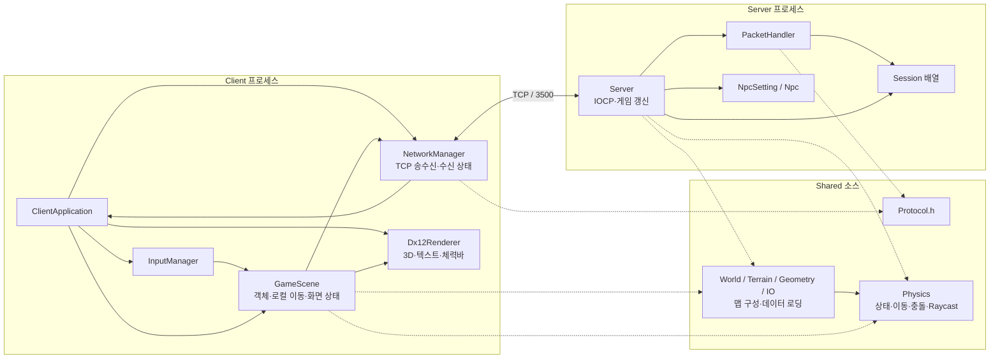
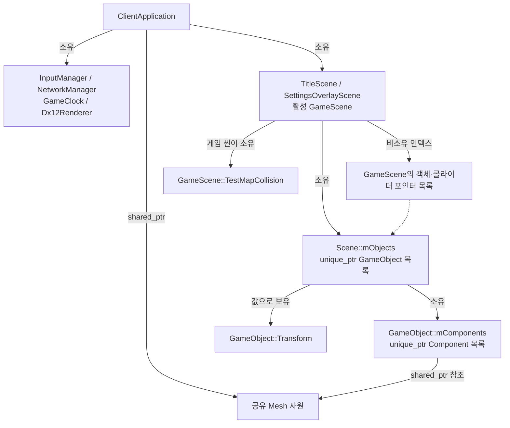
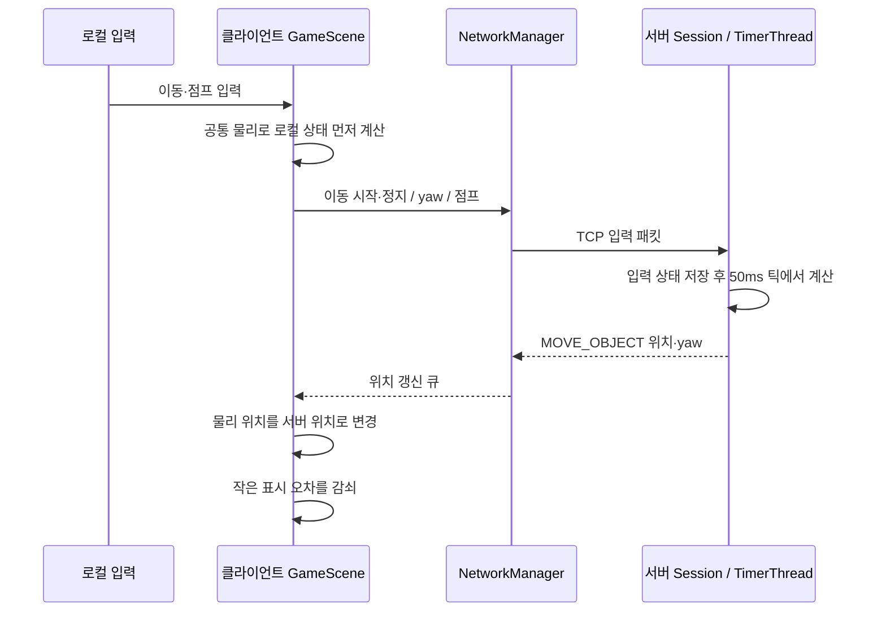
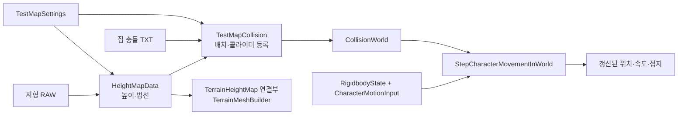
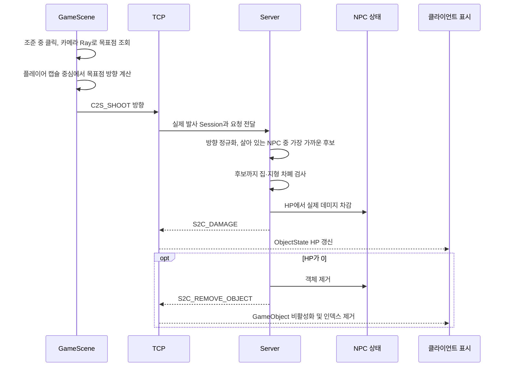

# 프로젝트 아키텍처

이 프로젝트는 **Windows용 DirectX 12 클라이언트, 게임 상태를 확정하는 C++ 서버, 양쪽에서 재사용하는 Shared 코드**로 구성됩니다. 클라이언트는 객체·컴포넌트 구조로 입력과 화면을 관리하고, 서버는 세션과 NPC 데이터를 중심으로 이동 및 전투 결과를 처리합니다.

현재 구현의 중심은 테스트 지형·집, 플레이어 이동·점프·조준, 온라인 객체 동기화, NPC 사격·HP 표시입니다. 플레이어 이동과 맵 충돌 계산은 공통화되어 있고, 클라이언트에는 선행 이동과 서버 위치 보정이 있습니다. 입력 기록을 이용한 재시뮬레이션은 아직 없습니다.

- 기준: 2026-09-15, `refactor/shared-character-physics` / `93ae240`
- 범위: Client·Server·Shared의 C++ 헤더/소스 131개를 대상으로 모듈 구성과 주요 호출 경로를 검토하고, 솔루션·프로젝트 설정, HLSL, 에셋 변환 도구를 함께 확인했습니다.
- 이 문서는 현재 소스 구조를 설명합니다. 실행 결과나 성능 측정 결과를 의미하지 않습니다.
- 기존 초기 설계 문서와 다른 부분은 아래의 실제 호출 경로를 기준으로 구분합니다.

빠른 이동:

- [전체 구조](#1-전체-시스템) · [모듈별 책임](#3-모듈별-책임) · [객체 소유](#4-객체-소유와-수명)
- [클라 실행](#5-클라이언트-실행-흐름) · [서버 스레드](#6-서버-실행과-동기화) · [네트워크·예측](#7-네트워크와-상태-반영)
- [맵·물리](#8-공통-맵과-물리) · [NPC·사격](#9-npc와-사격hp) · [렌더링](#10-카메라렌더링ui) · [에셋](#11-에셋과-좌표계)
- [구현 경계](#12-구현-경계와-남아-있는-연결) · [기능별 수정 위치](#13-수정하려는-기능별-시작-지점)

## 1. 전체 시스템



실선은 실행 중 호출 또는 데이터 전달, 점선은 공통 소스 의존성을 나타냅니다. Shared는 네트워크 서비스나 공유 메모리가 아닙니다. 같은 소스를 각 실행 파일에 컴파일하며, 클라이언트와 서버는 각각 별도의 상태와 충돌 월드를 가집니다.

| 구분 | 현재 역할 | 상태의 기준 |
| --- | --- | --- |
| Client | 입력 수집, 로컬 플레이어 선행 계산, 서버 결과 표시, 카메라·렌더링·UI | 화면은 로컬에서 계산하고 온라인 플레이어 위치는 서버 결과로 보정 |
| Server | 접속·패킷 처리, 플레이어 이동 계산, NPC 이동, 명중·HP·제거 확정 | 온라인 게임 상태의 최종 기준 |
| Shared | 패킷 정의, 공통 물리와 맵 데이터 처리 | 어느 한 프로세스의 상태를 소유하지 않는 재사용 코드 |
| Assets / Tools | 모델·지형·셰이더·폰트, 모델 변환 | 파일로 제공되는 입력 데이터 |

현재 서버에는 방·매치별 월드 구분이나 DB 저장 계층이 없습니다. 접속한 플레이어와 NPC가 하나의 서버 월드를 사용합니다.

## 2. 저장소와 빌드 경계

```text
KimganeCapstone.sln                  클라이언트 솔루션
Client/
  Kimgane.Client.vcxproj
  src/Main.cpp
  src/Engine/
    Application/  Core/  Scene/
    Input/  Gameplay/  Camera/
    Physics/  Terrain/
    Rendering/  Network/  Diagnostics/  Math/
Server/
  KimganeServer.sln                  서버 솔루션
  KimganeServer/
    KimganeServer.vcxproj
    src/
      Main.cpp  Core/  Network/  Npc/  Terrain/  Config/
Shared/
  Protocol.h
  Physics/  Terrain/  World/  Geometry/  IO/  Tests/
Assets/
  Models/  Shaders/  Fonts/
Tools/
  export_model_txt.py
Docs/
```

| 항목 | 현재 코드 기준 |
| --- | --- |
| 실행 파일 | `Kimgane.Client`, `KimganeServer` |
| 솔루션 | 루트 솔루션은 Client만 포함. Server는 별도 솔루션 |
| 언어·도구 집합 | 두 프로젝트 모두 C++20, `v143` |
| 플랫폼 구성 | Client는 x64, Server는 Win32·x64 구성 |
| 클라이언트 그래픽 의존성 | DirectX 12, DXGI, DirectXMath, D3DCompiler, D3D11On12, Direct2D, DirectWrite |
| 네트워크 의존성 | Windows WinSock. 서버는 overlapped I/O와 IOCP 사용 |
| Shared 연결 방식 | 별도 라이브러리 프로젝트 없이 필요한 `.cpp`를 각 `.vcxproj`에 등록 |
| 런타임 데이터 | 모델 TXT·OBJ, 지형 RAW, 집 충돌 TXT, HLSL, 폰트 파일 |

Shared의 Physics와 맵 계산 타입은 GameObject·Session·DirectX에 의존하지 않습니다. 다만 Shared 전체가 플랫폼 독립적인 것은 아닙니다. `Terrain/TerrainHeightMap`은 클라이언트용 DirectX 연결부이고, `IO/AssetPathResolver`는 Windows 실행 파일 경로 API를 사용합니다.

근거: [클라이언트 프로젝트](../Client/Kimgane.Client.vcxproj), [서버 프로젝트](../Server/KimganeServer/KimganeServer.vcxproj).

## 3. 모듈별 책임

| 모듈 | 주요 타입·함수 | 담당하는 일 |
| --- | --- | --- |
| Client/Application | `ClientApplication` | Win32 창, 초기화·종료, 씬 전환, 프레임 단계 연결 |
| Client/Core | `GameClock`, `GameObject`, `Component`, `Transform` | 시간, 객체·컴포넌트 소유, 위치·회전·스케일 |
| Client/Scene | `Scene`, `GameScene`, 타이틀·설정·로컬·온라인 씬 | 객체 구성, 물리 호출, 네트워크 객체 표시, 사격 입력과 HP 반영 |
| Client/Input | `InputManager`, `InputState` | 키의 유지·눌림·해제, 마우스 이동, 정규화한 이동 축 |
| Client/Gameplay | `PlayerControllerComponent`, `NetworkSmoothingComponent` | 카메라 기준 이동 입력, 방향 패킷, NPC 표시 위치 추종 |
| Client/Camera | `CameraComponent`, `SpringArmCamera` 등 | 추적·마우스 회전·어깨 조준, View/Projection 생성 |
| Client/Physics | `RigidbodyComponent`, 콜라이더 컴포넌트, `CollisionManager` | 엔진 객체와 Shared 물리 상태 연결, 컴포넌트 형상·조회 |
| Client/Terrain | `TerrainMeshBuilder` | 공통 높이 데이터로 GPU에 보낼 지형 메시 생성 |
| Client/Rendering | `Dx12Renderer`, `Mesh`, `Material`, `ShaderCompiler` | GPU 자원·파이프라인, 객체 그리기, 2D 오버레이 |
| Client/Network | `NetworkManager` | TCP 접속·송수신, 패킷 조립, 수신 상태와 이벤트 큐 |
| Client/Diagnostics | `ColliderDebugDrawSystem`, `ComponentSmokeTests` | 콜라이더 시각화와 별도 검증 코드 |
| Server/Core | `Server`, `Session`, `ExpOver` | IOCP, 소켓·세션, 게임 갱신, 결과 송신 |
| Server/Network | `PacketHandler` | 패킷 종류를 해석하고 세션 입력 또는 서버 동작에 전달 |
| Server/Npc | `NpcSetting`, `Npc` | NPC 소유, 초기 배치, 랜덤 이동, HP 데이터 |
| Shared/Physics | `CharacterMovement`, `CollisionWorld`, `RigidbodyIntegrator` 등 | 이동 적분, 접촉 조회·해결, 형상 판정, Raycast |
| Shared/World·Terrain | `TestMapCollision`, `TestMapSettings`, `HeightMapData` | 공통 맵 설정, 지형 샘플링, 충돌 월드 구성 |
| Shared/Geometry·IO | `ObjLoader`, `CollisionBoxLoader`, `AssetPathResolver` | CPU 데이터 로딩과 에셋 경로 검색 |

현재 게임별 구성과 일부 규칙은 `Client/src/Engine/Scene/Scene.cpp`의 `GameScene`에 모여 있습니다. `Client/Game` 같은 별도 게임 계층으로 분리된 상태는 아닙니다. 서버는 클라이언트의 GameObject·Component 모델을 사용하지 않습니다.

## 4. 객체 소유와 수명



- `Scene`이 GameObject를 소유하고, GameObject가 컴포넌트를 소유합니다. 컴포넌트는 소유 GameObject의 참조를 받습니다.
- `GetComponent<T>()`는 컴포넌트 목록을 순회하고 `dynamic_cast`로 첫 항목을 찾습니다. `GetComponents<T>()`는 같은 타입 전체를 반환합니다. 집 하나에 여러 박스 콜라이더를 붙일 때 사용합니다.
- 씬과 컴포넌트는 등록 순서로 갱신합니다. 별도의 ECS 저장소나 시스템별 병렬 스케줄러는 없습니다.
- `GameScene::mLocalPlayer`, `mTerrain`, `mHouseColliders`, `mNetworkPlayers`는 Scene이 소유한 객체를 가리키는 비소유 참조입니다. 서버 객체 ID를 클라이언트 GameObject에 연결하는 인덱스도 이 계층에 있습니다.
- 네트워크 객체 제거 시 GameObject를 비활성화하고 인덱스에서 제거합니다. 객체 메모리는 Scene의 소유 목록에 남았다가 씬 파괴·Clear 시 해제됩니다.
- `Scene::Clear()`는 콜라이더 등록을 먼저 비우고 객체를 해제합니다.
- 서버의 전역 `clients` 배열은 `unique_ptr<Session>`을, `NpcSetting::gNpcs`는 `unique_ptr<Npc>`를 소유합니다. Server는 지형과 맵 충돌 월드를 소유합니다.
- `TestMapCollision`은 지형 sampler를 소유합니다. 충돌 body의 지형 포인터는 비소유이지만, sampler의 공유 소유권이 맵 복사·이동 후에도 데이터 수명을 유지합니다.

근거: [GameObject](../Client/src/Engine/Core/GameObject.h), [Scene](../Client/src/Engine/Scene/Scene.h), [Session](../Server/KimganeServer/src/Core/Session.h), [TestMapCollision](../Shared/World/TestMapCollision.h).

## 5. 클라이언트 실행 흐름

### 초기화와 씬

`wWinMain → ClientApplication::Run → InitializeWindow → InitializeClient → RunMessageLoop` 순서로 시작합니다.

초기화 단계에서 입력·렌더러와 테스트 에셋을 준비하고, 타이틀·설정 씬을 구성합니다. 로컬 또는 온라인 게임을 선택하면 해당 GameScene을 새로 만들어 같은 맵 구성 코드를 실행합니다.

| 씬 | 현재 역할 |
| --- | --- |
| `TitleScene` | 로컬 테스트·서버 접속·설정 선택 |
| `LocalGameScene` | 네트워크 이동 입력 송신을 끄고 로컬 물리 실행. 회전 테스트 큐브 포함 |
| `OnlineGameScene` | TCP 연결을 시도하고 네트워크 이동 입력 사용. 회전 테스트 큐브 제외 |
| `SettingsOverlayScene` | 현재 씬 위에 설정 UI 표시, FPS 표시 옵션 변경 |

현재 온라인 진입 함수는 연결 시도의 반환값으로 씬 진입을 제한하지 않습니다. 설정 오버레이가 열리면 GameScene의 갱신은 중단하지만, 앱의 네트워크 수신·서버 위치 반영 단계는 계속 진행됩니다. 서버 전체를 일시정지하는 구조가 아닙니다.

### 프레임 순서

```text
Win32 메시지 처리
  ↓ 렌더할 프레임
GameClock::Tick
  → ProcessInput
  → UpdateScene
      → 일반 컴포넌트 갱신: 입력 준비·카메라·NPC 표시 추종
      → 로컬 테스트 장애물의 Shared 형상 갱신
      → 로컬 플레이어 물리 60Hz
      → 콜라이더 디버그·사격 입력·HP 반영
  → SendLocalPlayerStatePacket
  → NetworkManager::Update
  → ApplyNetworkPlayerLocations
  → UpdateCamera
  → Render
  → UpdateWindowTitle
```

`GameClock`은 일반 프레임 delta를 최대 0.1초로 제한하고, 별도로 실제 경과 시간을 제공합니다. GameScene은 실제 경과 시간을 `FixedStepClock`에 누적해 물리 계산 횟수를 구합니다. 한 번의 갱신에서 최대 8스텝을 실행하고, 긴 정지로 누적된 초과 정수 스텝은 버립니다.

`PlayerControllerComponent`는 입력을 카메라 기준 월드 XZ 방향으로 변환합니다. 점프 요청은 다음 물리 스텝이 소비할 때까지 보관합니다. 로컬 플레이어는 Rigidbody 자동 적분을 끄고 GameScene의 공통 이동 호출에서만 적분합니다.

| 처리 | 현재 주기 |
| --- | --- |
| 입력·카메라·일반 컴포넌트·클라이언트 수신 | 렌더 프레임마다 |
| 클라이언트 플레이어 물리 | 1/60초 |
| C2S 이동 시작·정지·회전·점프·사격 | 입력 변화 또는 이벤트 발생 시 |
| C2S_PLAYER_STATE | 누적 프레임 delta 기준 약 0.2초 |
| 서버 플레이어 이동·위치 송신 | `Sleep(50)` 루프, 계산 delta 0.05초 |
| NPC 새 위치 결정 | 서버 틱에서 경과 시간을 확인해 NPC별 최소 1초 간격 |

서버 루프는 실제로는 대기 시간에 처리 시간이 더해집니다. 표의 50ms는 코드의 대기·계산 기준이며 정밀한 실시간 주기 보장을 뜻하지 않습니다.

근거: [ClientApplication](../Client/src/Engine/Application/ClientApplication.cpp), [GameClock](../Client/src/Engine/Core/GameClock.cpp), [FixedStepClock](../Shared/Physics/FixedStepClock.h), [PlayerControllerComponent](../Client/src/Engine/Gameplay/PlayerControllerComponent.cpp).

## 6. 서버 실행과 동기화

`main → Server::Initialize → Server::Run`으로 시작합니다. 초기화에서 지형·집 충돌·NPC를 준비하고 listen 소켓과 IOCP를 생성합니다. 이어 TimerThread를 별도 스레드로 실행하고 AcceptEx를 등록합니다.

| 실행 경로 | 역할 | 동기화 |
| --- | --- | --- |
| 메인 스레드의 `Server::Run` | `GetQueuedCompletionStatus` 대기, accept·recv·send 완료 분기 | 완료 처리에 들어가기 전에 `mWorldMutex` 획득 |
| 별도 `Server::TimerThread` | 플레이어 이동·전송, NPC 갱신 | `Sleep(50)` 이후 같은 `mWorldMutex` 획득 |
| `Session::DoRecv / DoSend` | `WSARecv / WSASend` 비동기 작업 등록 | 완료 결과를 Run이 처리 |

현재 Run을 실행하는 IOCP 처리 스레드는 하나입니다. 별도의 작업자 풀이나 게임 명령 큐는 없습니다. TimerThread는 detach된 무한 루프이며 종료 요청·join 경로는 아직 없습니다.

세션에는 수신 버퍼와 조립 중인 바이트 수, 소켓·ID, 이동 키 상태, 이동 yaw, 표시 yaw, 점프 요청, `RigidbodyState`가 있습니다. 패킷 처리에서 입력을 기록하고 다음 게임 틱에서 소비합니다. 세션마다 추가 mutex를 두지 않고 기존 서버 월드 잠금으로 보호합니다.

TimerThread의 플레이어 처리 순서는 다음과 같습니다.

1. 이동 키와 이동 yaw로 `CharacterMotionInput` 생성.
2. 점프 요청을 한 번 소비.
3. 공통 이동 함수에 0.05초와 서버 충돌 월드 전달.
4. 결과 위치를 Session의 패킷 송신용 `mX/mY/mZ`에 반영.
5. 해당 플레이어 위치를 모든 연결된 클라이언트에 송신.
6. 모든 플레이어 처리 후 NPC 갱신.

플레이어 P명일 때 위치 송신 호출 수는 틱마다 대략 P×P입니다. 현재 관심 영역·거리별 전송 필터나 여러 객체를 묶는 스냅샷 패킷은 없습니다.

근거: [Server](../Server/KimganeServer/src/Core/Server.cpp), [Session](../Server/KimganeServer/src/Core/Session.cpp).

## 7. 네트워크와 상태 반영

### 전송과 패킷 경계

클라이언트는 `127.0.0.1:3500`에 TCP로 접속합니다. connect 이후 소켓을 nonblocking으로 전환하고, 매 프레임 Update에서 recv를 한 번 호출합니다. 별도 클라이언트 네트워크 스레드는 없습니다.

패킷은 [Shared/Protocol.h](../Shared/Protocol.h)의 packed 구조체를 그대로 송수신합니다. 각 구조체는 1바이트 `size`와 `PACKET_TYPE`으로 시작합니다. type은 별도의 1바이트 필드로 정의되어 있지 않습니다. 명시적 직렬화·버전 필드·바이트 순서 변환은 없으므로 양쪽 구조체 정의와 ABI가 일치해야 합니다.

TCP 바이트 스트림에서 패킷 하나가 여러 recv로 나뉘거나 여러 패킷이 합쳐지는 경우를 각각 조립합니다.

- 클라이언트: `ProcessData`가 현재 패킷의 남은 크기를 추적하고 완성되면 `ProcessPacket` 호출.
- 서버: `HandleRecv`가 완성된 패킷을 순서대로 처리하고 남은 바이트를 Session 버퍼 앞으로 이동.
- 양쪽 버퍼 상수는 현재 200바이트입니다. 전체 패킷에 대한 길이·타입·ID 검증과 클라이언트 부분 송신 재시도 체계는 충분히 갖춰지지 않았습니다.

### 사용 중인 메시지

| 방향 | 패킷 | 역할 |
| --- | --- | --- |
| C2S | LOGIN | 접속 후 초기 상태 요청. 현재 계정 인증·DB 조회 없음 |
| C2S | MOVE_START / MOVE_STOP | 방향 키 상태와 월드 이동 yaw 전달 |
| C2S | ROTATE | 캐릭터가 바라보는 yaw 전달. 이동 yaw와 별도 |
| C2S | JUMP | 점프 요청. 서버 틱의 공통 이동 함수가 허용 여부 결정 |
| C2S | PLAYER_STATE | 클라 위치·yaw·점프 플래그 전달. 서버에서는 위치 오차 계산 용도 |
| C2S | SHOOT | 발사 방향 전달. 서버는 패킷의 playerId 대신 실제 Session 사용 |
| S2C | AVATAR_INFO / LOGIN_RESULT | 자신의 ID·초기 위치, 로그인 처리 결과 |
| S2C | ADD_OBJECT | 다른 플레이어·NPC 생성 정보, NPC HP |
| S2C | MOVE_OBJECT / ROTATE | 객체 위치·yaw 갱신 |
| S2C | DAMAGE | 공격자·대상·실제 데미지·최대/현재 HP |
| S2C | REMOVE_OBJECT | 접속 해제 또는 NPC 사망에 따른 제거 |

`C2S_MOVE` enum과 `SendMoveInput` 선언은 남아 있지만, 현재 이동 호출 경로는 MOVE_START/MOVE_STOP입니다. PLAYER_STATE는 서버 이동의 원본 상태나 승인 패킷이 아니며, 클라는 현재 isJumping을 false로 전송합니다.

### 접속과 수신 상태

서버는 accept 시 Session을 만들고 공통 월드에서 스폰 접촉을 해결합니다. LOGIN 처리에서는 자신의 AVATAR_INFO와 기존 NPC 정보를 보내고, LOGIN_RESULT와 다른 플레이어 생성 정보를 전달합니다.

NetworkManager는 받은 데이터를 `ObjectState[MAX_OBJECTS]`에 보관합니다. 위치·회전은 `mLocationUpdates`, 제거는 `mRemovedPlayers` 큐에 넣습니다. ClientApplication이 위치 큐를 먼저, 제거 큐를 나중에 소비해 GameScene에 전달합니다. HP는 GameScene이 NetworkManager에서 읽어 HealthBarComponent에 반영합니다.

| 객체 | 수신 위치 적용 |
| --- | --- |
| 자신의 플레이어 | 기존 로컬 GameObject의 물리 위치를 서버 위치로 보정 |
| 다른 플레이어 | 처음에는 GameObject 생성, 이후 Transform 위치·yaw 직접 갱신 |
| NPC | 처음에는 생성·즉시 배치, 이후 `NetworkSmoothingComponent`로 최신 목표 위치 추종 |

NPC 표시 보간은 일정 속도로 목표 위치를 따라가는 방식입니다. 과거 스냅샷과 타임스탬프를 저장하는 보간 버퍼는 없습니다. 서로 다른 종류의 수신 이벤트는 별도 큐이므로 전체 이벤트가 하나의 수신 순서로 적용되는 구조도 아닙니다.

### 현재 예측 이동의 범위



이 도식은 논리적인 두 경로를 표시합니다. 실제 입력 패킷 송신은 PlayerController의 프레임 갱신에서 일어나며, 고정 물리 스텝과 일대일로 번호가 붙어 있지 않습니다.

보정 시 클라는 위치를 서버 값으로 바꾸고 현재 로컬 속도·접지 상태는 유지합니다. 서버가 속도·접지 상태를 보내지 않기 때문입니다. 렌더링에는 이전/현재 물리 위치의 보간과 별도 표시 오프셋을 적용하며 카메라도 이 표시 위치를 따라갑니다. 작은 오프셋의 반감기는 0.05초이고, 2m 이상의 큰 위치 차이나 표시 오프셋은 즉시 반영합니다.

입력 번호, 처리 완료 입력 번호, 입력 이력, 서버 상태 복원 후 재시뮬레이션은 없습니다. 클라 60Hz와 서버 50ms의 시간 간격도 다릅니다. 따라서 공통 물리 코드를 사용한다는 사실만으로 네트워크 오차나 모든 계산 결과가 일치하지는 않습니다.

근거: [NetworkManager](../Client/src/Engine/Network/NetworkManager.cpp), [PacketHandler](../Server/KimganeServer/src/Network/PacketHandler.cpp), [Scene의 네트워크 반영](../Client/src/Engine/Scene/Scene.cpp). 상세 패킷 문서는 [network-protocol.md](Network/network-protocol.md)를 참고합니다.

## 8. 공통 맵과 물리

### 맵 구성



| 공통 설정 | 현재 값 |
| --- | --- |
| 지형 | `Shared/Terrain/terrain_100x100.raw`, 명시적 RAW8 |
| 샘플·간격 | 513×513, 0.1953125m → XZ 범위 100m×100m |
| 지형 높이 배율 | 20m |
| 지형 원점 | 월드 중심 기준, 배치 (0, 0, 0) |
| 집 모델·충돌 | `Shared/Geometry/TestHouse.obj`, `TestHouse_collision.txt` |
| 집 배치 | (0, 4.71, 0)m |
| 플레이어 스폰 | (-5, 0, 0)m에서 시작해 공통 접촉 해결 |
| 플레이어 형상 | 발 위치 기준 세로 캡슐, 반지름 0.45m·전체 높이 1.8m |
| 기본 이동 | 속도 5m/s, 점프 속도 8m/s, 중력 Y=-20m/s² |

`HeightMapData`는 RAW 읽기, 높이 보간, 법선 계산을 공통으로 처리합니다. 클라이언트의 TerrainHeightMap은 공통 데이터를 DirectX 타입으로 변환하는 연결부이며, 서버의 같은 이름은 HeightMapData의 타입 별칭입니다.

`TestMapCollision`은 지형을 먼저 등록하고, 집의 박스를 파일 순서대로 등록합니다. 집 배치는 한 번만 적용합니다. 맵의 평행 이동과 AABB 집 충돌을 지원하며, 충돌 파일 끝의 회전 값은 현재 CollisionBoxLoader가 사용하지 않습니다.

지형·집 파일을 서버가 클라이언트에 전송하지는 않습니다. 양쪽 배포본이 같은 맵 파일과 설정을 갖고 있어야 합니다.

### 공통 이동 호출

`MakePlayerMovementState → ResolveCharacterContactsInWorld → StepCharacterMovementInWorld`를 양쪽에서 사용합니다.

한 이동 스텝은 수평 속도 설정, 접지 상태에 따른 점프, 강체 적분, 반복 접촉 해결 순서입니다. 접촉 해결은 최대 4회이며 위치 침투와 벽 방향 속도를 보정하고 접지를 결정합니다. 캐릭터 기본 drag·ground friction은 0으로 통일되어 있습니다.

- `RigidbodyState`: 위치·속도·가속도·힘·이전 위치·질량·중력·접지 등의 값.
- `CharacterMotionInput`: 월드 방향, 이동 속도, 점프 속도, 한 번 소비할 점프 요청.
- `CollisionWorld`: ID와 형상 값을 보관하는 vector registry.
- `CollisionQueries`: 형상끼리의 겹침·접촉 정보 계산.
- `CollisionResolver`: 침투 보정·벽 슬라이딩·걸을 수 있는 표면 판정.
- `RaycastQueries`: 사격 등에서 사용하는 광선 판정.

캐릭터 접촉은 환경을 ObjectA, 캐릭터를 ObjectB로 조회하며 자기 자신·trigger·충돌 마스크 불일치를 제외합니다. 후보 캡슐을 조회에 전달하므로 캐릭터 body를 월드에 상시 등록할 필요는 없습니다.

### 포인터 기반 컴포넌트와 ID 기반 월드

클라이언트에는 두 표현이 함께 있습니다.

| 표현 | 사용 목적 |
| --- | --- |
| `ColliderComponent*` / `CollisionManager` | 엔진 객체의 형상, 컴포넌트 조회·Raycast·디버그 표시 |
| Shared `CollisionBody` / `ObjectId` | 클라·서버가 같은 데이터와 규칙으로 플레이어 이동 충돌 계산 |

포인터를 서버로 전달하거나 포인터 값을 ID로 변환하지 않습니다. 클라 컴포넌트에서 필요한 형상 값을 읽어 공통 데이터에 연결합니다. 온라인 맵의 이동 충돌은 지형·집이며, 원격 플레이어와 NPC는 현재 이 이동 월드에 동적 장애물로 등록하지 않습니다. 로컬 회전 큐브는 매 프레임 월드 AABB로 갱신합니다.

| ID | 현재 용도 |
| --- | --- |
| 0~49 | 네트워크 플레이어 슬롯 |
| 50~59 | 네트워크 NPC |
| 10000 | 맵 지형 콜라이더 |
| 10001부터 | 집의 각 박스 콜라이더 |
| -2 / -3 | 로컬 테스트 큐브 / 로컬 플레이어 후보 캡슐 |
| -1 | 유효하지 않은 공통 ObjectId |

집의 여러 콜라이더는 서로 다른 ID를 사용합니다. 현재 ID는 세대 번호가 있는 범용 핸들로 확장되지는 않았습니다.

근거: [TestMapSettings](../Shared/World/TestMapSettings.h), [TestMapCollision](../Shared/World/TestMapCollision.cpp), [CharacterMovementWorld](../Shared/Physics/CharacterMovementWorld.h), [CharacterMovement](../Shared/Physics/CharacterMovement.cpp), [CollisionWorld](../Shared/Physics/CollisionWorld.cpp). 추가 설명은 [공통 캐릭터 월드 문서](Physics/shared-character-world.md)에 있습니다.

## 9. NPC와 사격·HP

### NPC

서버가 시작할 때 NpcSetting이 NPC 10개를 지형 범위 내 임의 위치에 생성하고 높이를 샘플링합니다. 각 NPC는 최소 1초 간격으로 XZ 좌표에 각각 -5~5 범위의 임의 변위를 더하고, 지형 높이를 다시 적용한 뒤 위치를 송신합니다.

이 이동은 플레이어용 Rigidbody·CharacterMovement를 거치지 않습니다. 현재 집 충돌, 경로 탐색, 목표 추적, 공격 AI, 맵 경계 제한은 연결되어 있지 않습니다. 클라는 받은 목표 위치를 8m/s의 표시 속도로 따라갑니다.

### 사격 처리



클라의 목표점 조회는 카메라에서 최대 100m까지 집·지형·NPC를 검사하며, 아무 대상도 맞지 않으면 발사 패킷을 보내지 않습니다. 이 결과로 HP를 확정하지는 않습니다.

서버는 플레이어 캡슐 중심에서 요청 방향으로 살아 있는 NPC 중 가장 가까운 후보를 찾고, 그 후보까지 지형·집이 가리는지 검사합니다. 현재 서버 판정에는 별도 최대 사거리가 없으며, 유효한 명중은 기본 10 데미지, NPC 기본 HP는 100입니다. 따라서 클라의 100m 목표점 조회와 서버 명중 정책을 같은 사거리 규칙으로 해석하면 안 됩니다.

GameScene은 수신 HP를 HealthBarComponent에 넣고, Dx12Renderer가 화면 좌표로 투영해 표시합니다. 체력바 표시 위치는 머리 위, 가림 판정 기준은 몸통 높이로 분리되어 있습니다.

현재 플레이어 HP·PvP 판정·발사 주기·탄약·재장전·서버 과거 상태를 이용한 명중 지연 보정은 연결되어 있지 않습니다.

근거: [Scene의 사격·HP](../Client/src/Engine/Scene/Scene.cpp), [서버 명중 처리](../Server/KimganeServer/src/Core/Server.cpp), [NpcSetting](../Server/KimganeServer/src/Npc/NpcSetting.cpp), [HealthBarComponent](../Client/src/Engine/Rendering/HealthBarComponent.h).

## 10. 카메라·렌더링·UI

### 카메라

실제 플레이 씬은 `CameraComponent → SpringArmCamera`를 사용합니다. 마우스로 yaw·pitch를 바꾸고, 조준 시 arm 길이와 어깨 오프셋을 보간합니다. 이동 방향과 조준 방향을 분리하기 위해 컨트롤러가 이동 yaw와 표시 yaw를 따로 송신합니다.

카메라는 마지막에 로컬 플레이어의 보간된 표시 위치를 따라갑니다. 타이틀·설정 UI에는 OrthographicCamera를 사용합니다. FirstPersonCamera·ThirdPersonCamera·SpectatorCamera 클래스도 있으나 현재 게임 씬의 활성 카메라는 아닙니다. SpringArmCamera의 충돌 거리 API는 존재하지만 게임 갱신에서 장애물 조회와 연결된 호출은 없습니다.

### 그리기

렌더러는 Device·Command Queue·Swap Chain·RTV/DSV·Depth Buffer·Root Signature·PSO·Command List·Fence를 소유합니다. 백버퍼는 2개이며, 프레임별 command allocator와 fence 값으로 자원 재사용을 제어합니다.

```text
BeginFrame: allocator/list 초기화, 백버퍼 전환, 화면·깊이 지우기
  → RenderScene(World, TriangleList)
      → 씬 상수: 카메라·DirectionalLight
      → Scene::Render
          → 활성 GameObject의 MeshComponent + MaterialComponent
          → 객체 상수: world·baseColor·surface·emission
          → Mesh::Render
  → RenderScene(World, LineList): 콜라이더 디버그
  → 설정이 열리면 RenderScene(Overlay)
  → EndFrame
      → GPU 명령 제출
      → D3D11On12 + Direct2D/DirectWrite 텍스트·체력바·조준점
      → Present(1, 0), 다음 프레임 fence 확인
```

Mesh의 정점 형식은 위치·법선·색상이고 선택적 인덱스를 사용합니다. 셰이더는 `Assets/Shaders/LitColor.hlsl`의 VSMain/PSMain을 런타임에 컴파일합니다. 조명은 하나의 방향광, ambient·diffuse·Phong specular·emission 조합입니다.

Material에 metallic·roughness 값이 있지만 현재 셰이더는 roughness를 specular 강도에 사용하며 metallic은 조명식에서 사용하지 않습니다. 현재 렌더 경로에는 텍스처 샘플링·PBR·스키닝 애니메이션이 연결되어 있지 않습니다.

TextComponent는 문자열·폰트·정렬을, HealthBarComponent는 HP와 높이 오프셋을 보관합니다. 렌더러는 Scene에서 이 컴포넌트들을 조회합니다. NPC 체력바의 가림 검사는 클라의 BoxCollider·TerrainCollider에 Raycast를 수행하므로 렌더러가 이 시각화용 물리 조회에도 의존합니다.

근거: [CameraComponent](../Client/src/Engine/Camera/CameraComponent.cpp), [SpringArmCamera](../Client/src/Engine/Camera/SpringArmCamera.cpp), [Dx12Renderer](../Client/src/Engine/Rendering/Dx12Renderer.cpp), [Mesh](../Client/src/Engine/Rendering/Mesh.h), [HLSL](../Assets/Shaders/LitColor.hlsl).

## 11. 에셋과 좌표계

| 데이터 | 경로·처리 | 사용처 |
| --- | --- | --- |
| 플레이어·NPC 모델 | `Assets/Models/paladin_test.txt`, `zombiegirl.txt` → FbxModelMesh | 클라이언트 정적 메시 |
| 집 모델 | `Shared/Geometry/TestHouse.obj` → ObjLoader → ObjModelMesh | 클라이언트 집 표시 |
| 집 충돌 | `TestHouse_collision.txt` → CollisionBoxLoader → TestMapCollision | 양쪽 이동·서버 사격 장애물 |
| 지형 | RAW → HeightMapData, 클라에서는 TerrainMeshBuilder 추가 | 양쪽 높이·법선·충돌, 클라 메시 |
| 셰이더 | `Assets/Shaders/LitColor.hlsl` → ShaderCompiler | 3D 그리기 |
| 폰트 | `Assets/Fonts/Paperlogy-1.001`의 TTF → DirectWrite | UI 텍스트 |

FbxModelMesh는 FBX SDK로 FBX를 직접 읽는 런타임 로더가 아닙니다. 변환된 TXT의 프레임 계층·행렬·정점·법선·인덱스를 읽고 하나의 Mesh 데이터로 합칩니다. `Tools/export_model_txt.py`는 Blender에서 모델을 이 형식으로 내보내는 오프라인 도구이며 게임 실행 중에는 호출하지 않습니다.

월드 계산은 거리 m, 시간 s, 각도 rad, +Y 위쪽, 플레이어 위치는 발 기준입니다. Blender 변환 도구는 Z-up 모델을 DirectX 좌표로 바꾸고, 게임의 Transform은 스케일·회전·이동 순서로 월드 행렬을 만듭니다.

AssetPathResolver는 지정 경로, 현재 작업 디렉터리, 실행 파일 디렉터리와 최대 5단계 상위 경로를 검색합니다. 현재 에셋은 런타임 파일 경로에 의존하며 별도 패키지·스트리밍 계층은 없습니다.

근거: [모델 변환 도구](../Tools/export_model_txt.py), [FbxModelMesh](../Client/src/Engine/Rendering/FbxModelMesh.cpp), [TerrainMeshBuilder](../Client/src/Engine/Terrain/TerrainMesh.cpp), [AssetPathResolver](../Shared/IO/AssetPathResolver.cpp).

## 12. 구현 경계와 남아 있는 연결

| 항목 | 현재 상태 |
| --- | --- |
| 입력 재시뮬레이션 | 입력 번호·서버 처리 확인·이력·상태 복원은 미구현. 현재는 선행 이동과 위치 보정 |
| NPC 물리 | 공통 높이 데이터는 사용하지만 플레이어용 공통 이동·집 충돌은 사용하지 않음 |
| 원격 플레이어 표시 | 최신 위치 직접 적용. NPC와 같은 추종 컴포넌트나 스냅샷 보간 버퍼 없음 |
| 서버 생명주기 | 단일 IOCP 처리 루프와 detached TimerThread. 종료 신호·join 설계 없음 |
| 접속 관리 | 단순 증가하는 playerID 사용. 슬롯 재사용과 배열 접근 전 상한 검사가 보강되어야 함 |
| 클라 접속 상태 | IsConnected 중심. 연결 실패와 로그인 완료를 구분한 씬 진입 상태 머신 없음 |
| 이벤트·전송 | 위치/제거 큐 분리, 전체 플레이어 대상 개별 송신. 관심 영역·스냅샷 묶음 없음 |
| 렌더링 확장 | 텍스처·스키닝·그림자·창 크기에 따른 자원 재생성은 현재 경로에 없음 |
| 게임 서비스 | 방·매칭·계정 인증·DB 저장·라운드 진행은 현재 구현에서 확인되지 않음 |

아래 파일·API는 현재 활성 게임 경로와 구분해서 읽어야 합니다.

- **ClientNetworkFacade:** 과거 mock 통신용 구현. 실제 앱은 NetworkManager를 사용하며 Facade cpp는 Client 프로젝트의 컴파일 목록에 없습니다.
- **ComponentSmokeTests:** 검증 코드가 있지만 cpp는 Client 컴파일 목록에 없고 앱 초기화 호출도 주석 처리되어 있습니다. 자동 실행 중인 것으로 보지 않습니다.
- **Shared/Tests/CharacterMovementTests.cpp:** 이동·충돌·지형·맵 수명·고정 시간 검증을 위한 별도 main. 현재 두 앱 프로젝트에는 포함되지 않습니다.
- **ServerTerrain:** `Map/height.raw`를 읽는 별도 래퍼가 남아 있지만 현재 Server 초기화에서 호출하지 않습니다. 실제 경로는 `LoadTestMapTerrain`입니다.
- **Camera 파생 클래스·충돌 거리 API:** 구현 파일이 있다는 사실과 현재 GameScene에 연결되어 있다는 사실을 구분합니다.

이 표는 현재 구현 범위를 설명하기 위한 것이며, 서버 스레드 구조 변경이나 네트워크 예측 확장을 이번 문서 작업에서 수행한 것은 아닙니다.

## 13. 수정하려는 기능별 시작 지점

| 바꾸려는 내용 | 먼저 볼 파일 | 함께 확인할 연결 |
| --- | --- | --- |
| 지형·집 배치 | [TestMapSettings](../Shared/World/TestMapSettings.h), [TestMapCollision](../Shared/World/TestMapCollision.cpp) | 양쪽 맵 파일, 클라 메시·콜라이더, NPC의 별도 지형 좌표 처리 |
| 플레이어 속도·점프·접촉 규칙 | [PhysicsSettings](../Shared/Physics/PhysicsSettings.h), [CharacterMovement](../Shared/Physics/CharacterMovement.cpp) | 클라 Rigidbody 연결, 서버 Session, 테스트 |
| 키·이동 방향·조준 | [InputManager](../Client/src/Engine/Input/InputManager.cpp), [PlayerControllerComponent](../Client/src/Engine/Gameplay/PlayerControllerComponent.cpp) | CameraComponent, 이동 yaw와 표시 yaw, 입력 패킷 |
| 예측 보정 확장 | [Protocol](../Shared/Protocol.h), [Scene](../Client/src/Engine/Scene/Scene.cpp) | NetworkManager, PacketHandler, Session, Server 틱의 입력 시간 기준 |
| NPC 행동 | [NpcSetting](../Server/KimganeServer/src/Npc/NpcSetting.cpp), [Npc](../Server/KimganeServer/src/Npc/Npc.cpp) | 클라 NetworkSmoothing, HP·제거 이벤트 |
| 사격·피해 정책 | [Server::HandleShoot](../Server/KimganeServer/src/Core/Server.cpp) | 클라 목표점 조회, Protocol, Session 송신, HP 표시 |
| 화면·머티리얼·UI | [Dx12Renderer](../Client/src/Engine/Rendering/Dx12Renderer.cpp), [LitColor.hlsl](../Assets/Shaders/LitColor.hlsl) | Scene 상수, Mesh/Material/Text/HealthBar 컴포넌트 |
| 씬 전환·프레임 순서 | [ClientApplication](../Client/src/Engine/Application/ClientApplication.cpp) | Scene 구성·수명, 네트워크 상태, 카메라 |
| 새 패킷 | [Protocol](../Shared/Protocol.h) | 양쪽 송신·수신 분기와 [프로토콜 문서](Network/network-protocol.md) |

## 14. 함께 읽을 문서

- [공통 맵 충돌과 캐릭터 이동](Physics/shared-character-world.md): 이번 Shared 통합의 범위와 데이터 소유.
- [네트워크 프로토콜](Network/network-protocol.md), [NetworkManager](Network/network-manager.md): 패킷·통신 상세.
- [렌더링 파이프라인](rendering-pipeline.md): 렌더링 관련 별도 설명.
- [단위 규약](engineering-units.md): 거리·시간·각도·좌표계 기준.
- [협업 규약](../CONTRIBUTING.md): 브랜치·커밋·PR·코드 스타일.
- [Task Board](task-board.md): 작업 기록.

기존 상세 문서와 과거 검증 기록은 작성 시점이 다릅니다. 현재 활성 구현 여부는 이 문서의 실행 경로 및 연결된 소스를 함께 확인합니다.
